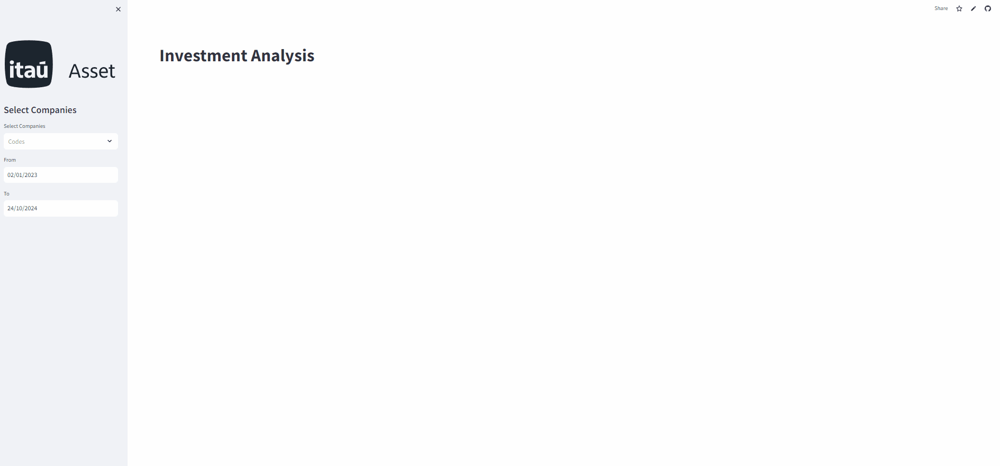

  

  

A cool gif from a recent projectI have been working on.

## Selected Working Papers
Western Relationship, China and Taiwan: Approach using econometrics to assess tensions. Mapa Mundi, 6(1), 1-27. Co-authored with Ricardo Cintra.

International Diversification via ETFs from the Perspective of the Sharpe Index. ENANGRAD, 33(1), 1-15. Co-authored with Igor Gondim.

## Works in Progress

International Strategies and Marketing: An Analysis of Semiconductor Internationalization to Japan. Co-authored with Jose Pimenta.

## Publications

SOUSA, A. C., UEHARA, A. R., & KIM, H. N. (2022). Why invest your money in Japanese J-REITs?. Mapa Mundi. 

SOUSA, A. C., UEHARA, A. R., & KIM, H. N. (2022). The Triangular Relationship Between the United States, Taiwan, and China at the Start of the Biden Administration. Mapa Mundi.

SOUSA, A. C., & Kim, J. (2022). Asian Financial Crisis of 1997. Coreiapedia. 

SOUSA, A. C., & Kim, J. (2022). Economy of South Korea. Coreiapedia. 

SOUSA, A. C., & Kim, J. (2022). South Korean Financial Market. Coreiapedia.

SOUSA, A. C., & Kim, J. (2022). Asian Tigers. Coreiapedia. 

SOUSA, A. C., & Kim, J. (2022). Korean Won. Coreiapedia. 

SOUSA, A. C., & Kim, J. (2022). Miracle on the Han River. Coreiapedia. 

SOUSA, A. C., UEHARA, A. R., & KIM, H. N. (2021). Is it Worth for Brazilians to Invest in ETFs in South Korea?. Mapa Mundi. 